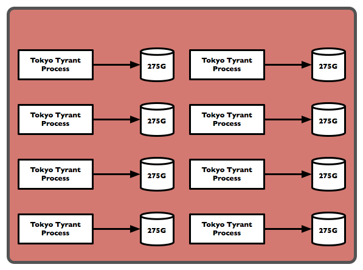

!SLIDE incremental bullets transition=toss

# Part 1 - Message Storage System #

* must store 1 billion messages (per year)
* efficient use of disk space
* accessible via a "key"
* must use HTTP
* easy backup strategy

!SLIDE incremental bullets

# Tokyo Tyrant #

* Network accessible Key-Value store
* single file DB
* values can be compressed
* Has a RESTful interface
* built in replication 

!SLIDE incremental bullets

# How we use Tyrants #

* cluster them (~250M keys / tyrant, bnum=1000000000)
* compressed values ( opts=ld )
* write once rule ( 'putkeep' mode )
* global keyspace (across all tyrants)
* partitioned keyspace ( somewhat like consistent hashing )

!SLIDE 
## 250,000,000 ~1.5KiB messages ##

<table width="100%" border="2" cellpadding="10" cellspacing="10">
  <tr><th></th><th style="padding: 10px;">Files</th><th style="padding: 10px;">Storage Used</th></tr>
  <tr>
    <th style="padding: 10px;">Filesystem (4KiB blocksize)</th>
    <td style="padding: 10px; text-align: right;">250,000,000</td>
    <td style="padding: 10px; text-align: right;">954GiB</td>
  </tr>
  <tr>
    <th style="padding: 10px;">Tokyo Cabinet (compressed values)</th>
    <td style="padding: 10px; text-align: right;">1</td>
    <td style="padding: 10px; text-align: right;">189GiB</td>
  </tr>
</table>

!SLIDE center
# 2x Physical Server #

!SLIDE incremental bullets
# How do you manage all those tyrants? #

* gem install tyrantmanager
* <http://github.com/copiousfreetime/tyrantmanager>

!SLIDE 
# Why not S3? #
## 2.2 Billion messages ~ 1.6TiB ##

<table width="100%" border="2" cellpadding="10" cellspacing="10">
  <tr>
    <th>1 year of processing</th>
    <th style="padding: 10px;">hardware</th>
    <th style="padding: 10px;">services</th>
  </tr>
  <tr>
    <th style="padding: 10px;">Tokyo Cabinet</th>
    <td style="padding: 10px; text-align: right;">$20,000</td>
    <td style="padding: 10px; text-align: right;">$0</td>
  </tr>
  <tr>
    <th style="padding: 10px;">S3</th>
    <td style="padding: 10px; text-align: right;">$0</td>
    <td style="padding: 10px; text-align: right;">
        

        <table>
            <tr>
                <td>PUT</td>
                <td style="align: right; padding: 5px;">$0.00001/req</td>
                <td style="align: right; padding: 5px;">$22,000</td>
            </tr>
            <tr>
                <td>GET</td>
                <td style="align: right; padding: 5px;">$0.1/GiB</td>
                <td style="align: right; padding: 5px;">$220</td>
            </tr>
            <tr>
               <td>Storage</td>
               <td style="align: right; padding: 5px;">$0.15/GB/Month</td>
               <td style="align: right; padding: 5px;">$2,200</td>
            </tr>
            <tr>
               <th>Total</th>
               <td></td>
               <td sytle="align: right; padding: 5px;">$24,420</td>
            </tr>
        </table>
        

    </td>
  </tr>
</table>

