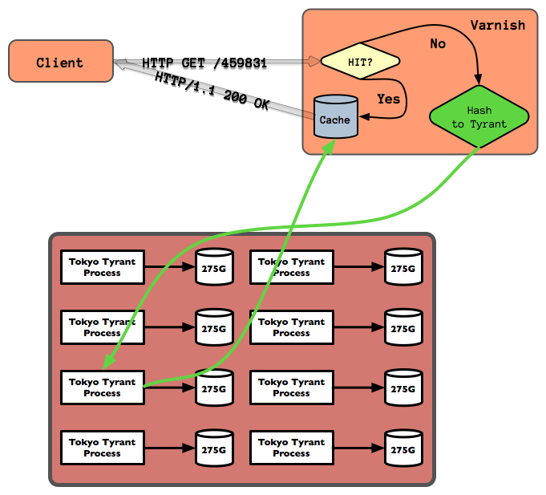

!SLIDE incremental bullets transition=toss

# Routing #

* N Tyrants for storage
* need a flexible way to route requests to the right Tyrant

!SLIDE incremental bullets 

# Varnish #

!SLIDE bullets 

* Varnish is a state-of-the-art, high-performance HTTP accelerator
* <http://varnish-cache.org/>

!SLIDE

# Varnish Configuration Language #

!SLIDE

## The Varnish Configuration Language is a small domain-specific language designed to be used to define request handling and document caching policies for the Varnish HTTP accelerator. ##

!SLIDE

# What this really means ? #

!SLIDE incremental bullets

* <em>define request handling</em> : Request comes in, where do I send it
* <em>document caching policies</em> : Response comes out, how long do I cache it

!SLIDE smaller code 

    @@@ C
    # now deal with the various Methods we support.  
    # GET and HEAD do the lookup and such as normal
    if ( req.request == "GET" || req.request == "HEAD" ) {
      lookup; # do cache lookup return from there if possible
    } else if ( req.request == "PUT" ) {
       pass;
    } else {
       error 405 "Only GET, HEAD, PUT are supported in the Message Archive.";
    }

!SLIDE smaller code

    @@@ C
    sub vcl_pass {
        if ( ( req.request == "PUT" ) && 
            !( req.http.X-Archive-Overwrite ~ "true" ) ) { 
            set bereq.http.X-TT-PDMODE = "1";
        }   
        if ( req.restarts == 2 ) { 
            error 542 "Failure to get to any backend";
        }   

        C{  
            long mab = set_message_archive_backend( sp );
            if ( mab > 0 ) { 
                VRT_done( sp, VCL_RET_PASS);
            } else {
                const char *url_tmp = VRT_r_req_url( sp );
                fprintf(stderr, "(%s) Got an error on the backend (%li)\n", 
                        url_tmp, mab );
                VRT_done( sp, VCL_RET_ERROR);
            }   
        }C  
    }

!SLIDE center
## GET request ##

!SLIDE center

!SLIDE smaller commandline incremental
    $ tyrantmanager replication-status
    22:18:23  INFO : storage-000 is replicating from tt2.collectiveintellect.com:11001
    22:18:24  INFO :   tt2.collectiveintellect.com:11001 is replicating from tt1.collectiveintellect.com:11000
    22:18:24  INFO :   Primary master  : 10.10.12.15:11000 -> 271891032 records, primary since 2010-04-28 03:03:04
    22:18:24  INFO :   Failover master : 10.10.12.16:11001 -> 271891032 records, last replicated 0.051480 seconds ago
    22:18:24  INFO : storage-002 is replicating from tt2.collectiveintellect.com:11003
    22:18:26  INFO :   tt2.collectiveintellect.com:11003 is replicating from tt1.collectiveintellect.com:11002
    22:18:26  INFO :   Primary master  : 10.10.12.15:11002 -> 267555243 records, primary since 2010-04-28 03:05:27
    22:18:26  INFO :   Failover master : 10.10.12.16:11003 -> 267555243 records, last replicated 0.019087 seconds ago
    22:18:26  INFO : storage-004 is replicating from tt2.collectiveintellect.com:11005
    22:18:27  INFO :   tt2.collectiveintellect.com:11005 is replicating from tt1.collectiveintellect.com:11004
    22:18:27  INFO :   Primary master  : 10.10.12.15:11004 -> 269048878 records, primary since 2010-04-28 03:08:32
    22:18:27  INFO :   Failover master : 10.10.12.16:11005 -> 269048879 records, last replicated 0.060052 seconds ago
    22:18:27  INFO : storage-006 is replicating from tt2.collectiveintellect.com:11007
    22:18:28  INFO :   tt2.collectiveintellect.com:11007 is replicating from tt1.collectiveintellect.com:11006
    22:18:28  INFO :   Primary master  : 10.10.12.15:11006 -> 272787644 records, primary since 2010-04-28 03:15:30
    22:18:28  INFO :   Failover master : 10.10.12.16:11007 -> 272787644 records, last replicated 0.055863 seconds ago
    22:18:28  INFO : storage-008 is replicating from tt2.collectiveintellect.com:11009
    22:18:29  INFO :   tt2.collectiveintellect.com:11009 is replicating from tt1.collectiveintellect.com:11008
    22:18:29  INFO :   Primary master  : 10.10.12.15:11008 -> 272429205 records, primary since 2010-04-28 03:18:39
    22:18:29  INFO :   Failover master : 10.10.12.16:11009 -> 272429205 records, last replicated 0.022693 seconds ago
    22:18:29  INFO : storage-010 is replicating from tt2.collectiveintellect.com:11011
    22:18:30  INFO :   tt2.collectiveintellect.com:11011 is replicating from tt1.collectiveintellect.com:11010
    22:18:30  INFO :   Primary master  : 10.10.12.15:11010 -> 275240222 records, primary since 2010-04-28 03:23:29
    22:18:30  INFO :   Failover master : 10.10.12.16:11011 -> 275240222 records, last replicated 0.019498 seconds ago
    22:18:30  INFO : storage-012 is replicating from tt2.collectiveintellect.com:11013
    22:18:31  INFO :   tt2.collectiveintellect.com:11013 is replicating from tt1.collectiveintellect.com:11012
    22:18:31  INFO :   Primary master  : 10.10.12.15:11012 -> 268850801 records, primary since 2010-04-28 03:26:48
    22:18:31  INFO :   Failover master : 10.10.12.16:11013 -> 268850801 records, last replicated 0.022359 seconds ago
    22:18:31  INFO : storage-014 is replicating from tt2.collectiveintellect.com:11015
    22:18:32  INFO :   tt2.collectiveintellect.com:11015 is replicating from tt1.collectiveintellect.com:11014
    22:18:32  INFO :   Primary master  : 10.10.12.15:11014 -> 265109588 records, primary since 2010-04-28 03:31:27
    22:18:32  INFO :   Failover master : 10.10.12.16:11015 -> 265109588 records, last replicated 0.028948 seconds ago

!SLIDE smaller commandline incremental

    $ varnishstat -1 
    uptime                   1921          .   Child uptime
    client_conn           1854869       965.57 Client connections accepted
    client_drop                 0         0.00 Connection dropped, no sess
    client_req            1854611       965.44 Client requests received
    cache_hit             1062485       553.09 Cache hits
    cache_hitpass               0         0.00 Cache hits for pass
    cache_miss             390074       203.06 Cache misses
    backend_conn              341         0.18 Backend conn. success
    backend_unhealthy            0         0.00 Backend conn. not attempted
    backend_busy                0         0.00 Backend conn. too many
    backend_fail                0         0.00 Backend conn. failures
    backend_reuse          785433       408.87 Backend conn. reuses
    backend_toolate             0         0.00 Backend conn. was closed
    backend_recycle        785747       409.03 Backend conn. recycles
    backend_unused              0         0.00 Backend conn. unused
    fetch_head                  0         0.00 Fetch head
    fetch_length           785763       409.04 Fetch with Length
    fetch_chunked               0         0.00 Fetch chunked
    fetch_eof                   0         0.00 Fetch EOF
    fetch_bad                   0         0.00 Fetch had bad headers
    fetch_close                 0         0.00 Fetch wanted close
    fetch_oldhttp               0         0.00 Fetch pre HTTP/1.1 closed
    fetch_zero                  0         0.00 Fetch zero len
    fetch_failed                0         0.00 Fetch failed

!SLIDE 

# Show varnishhist live #

