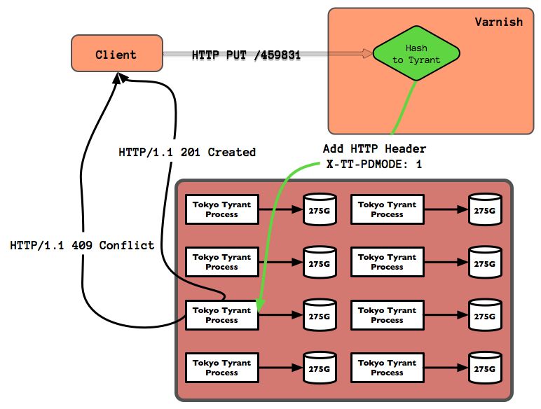

!SLIDE incremental bullets transition=toss

# Routing #

* N Tyrants for storage
* need a flexible way to route requests to the right Tyrant

!SLIDE incremental bullets 

# Varnish #

!SLIDE bullets 

* Varnish is a state-of-the-art, high-performance HTTP accelerator
* <http://varnish-cache.org/>

!SLIDE

# Varnish Configuration Language #

!SLIDE

## The Varnish Configuration Language is a small domain-specific language designed to be used to define request handling and document caching policies for the Varnish HTTP accelerator. ##

!SLIDE

# What this really means ? #

!SLIDE incremental bullets smaller
# <em>define request handling</em> : Request comes in, where do I send it #

    @@@ C
    # now deal with the various Methods we support.  
    # GET and HEAD do the lookup and such as normal
    if ( req.request == "GET" || req.request == "HEAD" ) {
      lookup; # do cache lookup return from there if possible
    } else if ( req.request == "PUT" ) {
       pass;
    } else {
       error 405 "Only GET, HEAD, PUT are supported.";
    }

!SLIDE smaller code
    @@@ C
    sub vcl_pass {
        if ( ( req.request == "PUT" ) && 
            !( req.http.X-Archive-Overwrite ~ "true" ) ) { 
            set bereq.http.X-TT-PDMODE = "1";
        }   
        if ( req.restarts == 2 ) { 
            error 542 "Failure to get to any backend";
        }   

        C{  
            long mab = set_message_archive_backend( sp );
            if ( mab > 0 ) { 
                VRT_done( sp, VCL_RET_PASS);
            } else {
                const char *url_tmp = VRT_r_req_url( sp );
                fprintf(stderr, 
                        "(%s) error on the backend (%li)\n", 
                        url_tmp, mab );
                VRT_done( sp, VCL_RET_ERROR);
            }   
        }C  
    }

!SLIDE center
## GET request ##

!SLIDE center

!SLIDE command

# $ man 1 varnishhist #

!SLIDE command

# $ man 1 varnishstat #

